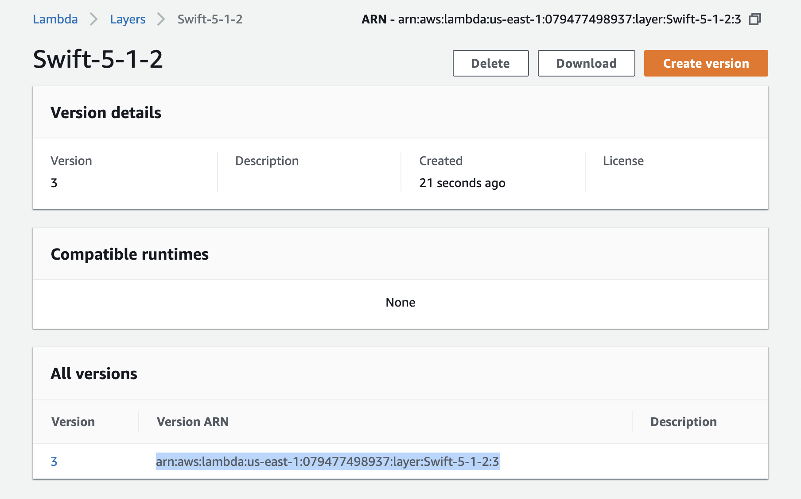
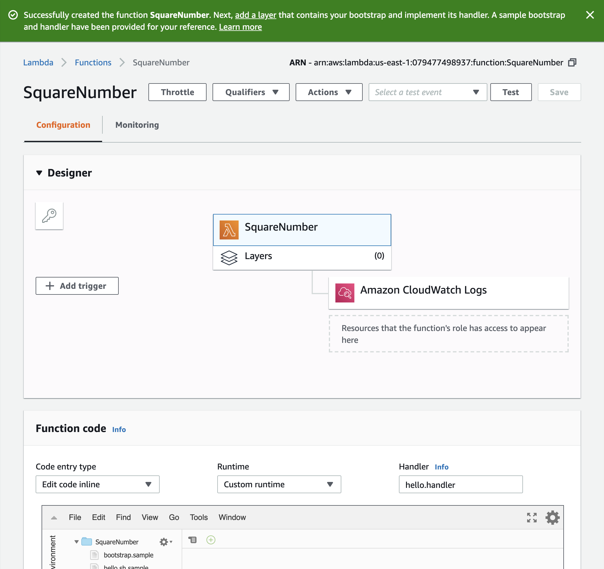
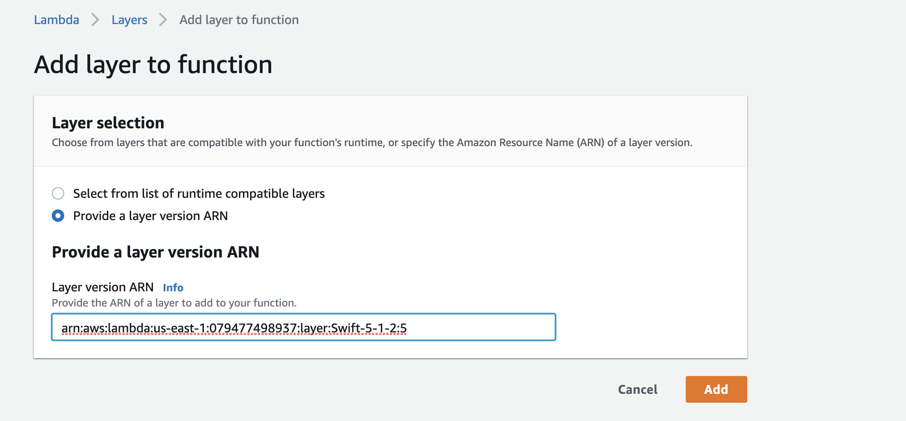
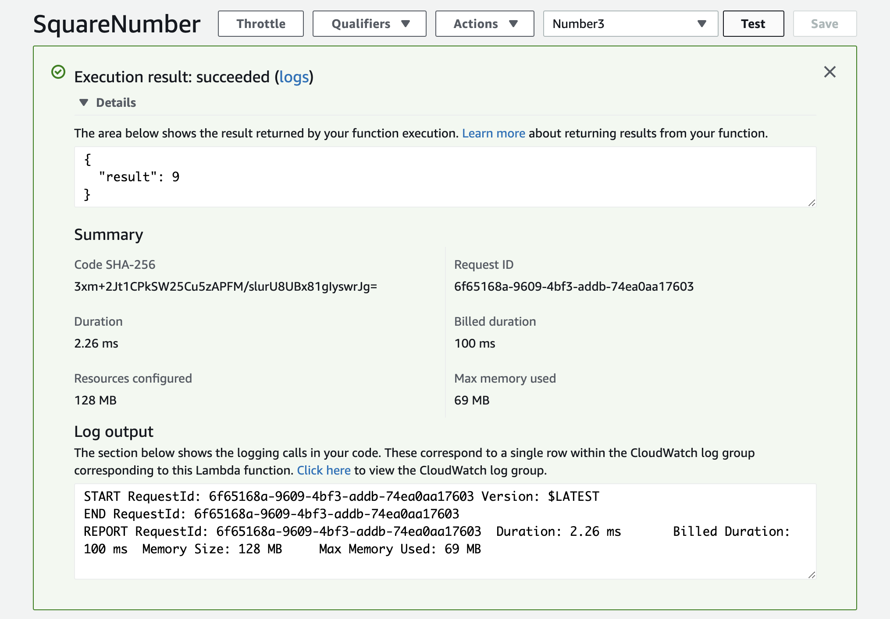

# swift-aws-lambda

[](https://swift.org/download/)
[](https://github.com/fabianfett/swift-aws-lambda/actions)
[](https://codecov.io/gh/fabianfett/swift-aws-lambda)


AWS unfortunately does not provide an official Swift runtime for its [Lambda](https://en.wikipedia.org/wiki/AWS_Lambda) offering. To leverage the benefits of Lambda and Swift on the server, someone needs to build this. That's what this project is about. Hopefully it is [sherlocked](https://www.urbandictionary.com/define.php?term=sherlocked) by AWS sooner rather than later. re:Invent is just around the corner. 🙃

In order to achieve the goal, this project consists out ot two parts:

1. A Swift [layer](https://docs.aws.amazon.com/lambda/latest/dg/runtimes-custom.html#runtimes-custom-build) to run Swift code within lambda. This provides the necessary libs for your Swift code to link against. In other words: without it, your Swift code won't run.
2. A Swift package that you can be used to retrieve your next invocation from the lambda runtime and to post your lambda result back to lambda. In other words: without it, your Swift code will not be able to process any tasks.

This project uses [Swift-NIO](https://github.com/apple/swift-nio). Therefore the developer facing API of this package expects to be initialized with an `EventLoopGroup`, exposes an `EventLoop` during an invocation as a property on the [`Context`](https://github.com/fabianfett/swift-aws-lambda/blob/5405bd30737a7347a95c7024bcb6f0a8fafb3931/Sources/AWSLambda/Context.swift#L16) and expects an `EventLoopFuture` to be returned. If you are not familiar with Swift-NIO, I recommend that you learn about [this first](https://github.com/apple/swift-nio#basic-architecture).

Your lambda needs to be built in the linux environment. So we use [Docker](https://en.wikipedia.org/wiki/Docker_(software)) to compile your lambda. If you don't have Docker yet, now is a good time to go and learn about that.

## Status

- [x] [Two examples](https://github.com/fabianfett/swift-aws-lambda/tree/master/Examples) to get you up and running as fast as possible (including an [API-Gateway Todo-List](http://todobackend.com/client/index.html?https://mwpixnkbzj.execute-api.eu-central-1.amazonaws.com/test/todos))
- [x] [Tested integration](https://github.com/fabianfett/swift-aws-lambda/blob/master/Examples/TodoAPIGateway/Sources/TodoAPIGateway/main.swift) with [`aws-swift-sdk`](https://github.com/swift-aws/aws-sdk-swift)
- [x] Unit and End-to-end Tests
- [x] CI Workflow with GitHub Actions
- [x] Wrapper function to build [a synchronous lambda](https://github.com/fabianfett/swift-aws-lambda/blob/7b542c1edf58b59cc7610cc1a9515f0b03332879/Sources/AWSLambda/Runtime%2BCodable.swift#L29)
- [ ] Ready to use [AWS Events](https://github.com/fabianfett/swift-aws-lambda/tree/master/Sources/AWSLambda/Events) structs to get you started as fast as possible

Alternatives: There is another project to run Swift within AWS-Lambda: [Swift-Sprinter](https://github.com/swift-sprinter/aws-lambda-swift-sprinter). 

## Create and run your first Swift Lambda

This should help you to get started with Swift on AWS Lambda. We focus primarily on the AWS console, since it is the easiest way to begin with. Of course you can use the [aws-cli](https://aws.amazon.com/cli/), [sam-cli](https://docs.aws.amazon.com/serverless-application-model/latest/developerguide/serverless-sam-cli-layers.html), the [serverless-framework](https://serverless.com/framework/docs/providers/aws/guide/layers/), [cloudformation](https://aws.amazon.com/cloudformation/) or whatever tooling you prefer at every step of your way. We even encourage you to do so in a production environment. Noone likes clicky architectures. 🤯 If you are looking for an example check out the [sam-template](https://github.com/fabianfett/swift-aws-lambda/blob/master/Examples/TodoAPIGateway/template.yaml) in the [TodoBackend](https://github.com/fabianfett/swift-aws-lambda/tree/master/Examples/TodoAPIGateway) example.

*Note: The following instructions were recorded on 21.11.2019 and the GUI may have changed since then. Feel free to create an issue if you notice something different.*

### Step 1: Create & setup your layer (Prepare AWS Lambda to run Swift)

Check out the repo and create a layer yourself within the project:

```bash
$ cd Layer
$ make package_layer
```

The makefile uses Docker under the hood. So, you need to have it installed by now. You can change the swift version of your layer by using the enviornment variable `SWIFT_DOCKER_IMAGE`. Example:

```bash
$ SWIFT_DOCKER_IMAGE=5.1.2 make package_layer
```

In the `Layer` directory you will now find an `swift-lambda-runtime.zip`.

Open your AWS Console and navigate to [Lambda](https://console.aws.amazon.com/lambda/home). Select "Layers" in the side navigation and click on "Create Layer" in the upper right corner. Give your runtime a name. I suggest: "Swift [Version]" (Sadly dots are not allowed in the name. 😞). Upload your zip layer from the `Layer` folder and click "Create".

Next you will see the following screen. Note the selected `Version ARN`. Please copy & paste that somewhere. You'll need it later.




### Step 2: Develop your lambda

Create a new SPM project and add "swift-aws-lambda" as a dependency. Your `Package.swift` should look something like this.

```swift
// swift-tools-version:5.1
// The swift-tools-version declares the minimum version of Swift required to build this package.

import PackageDescription

let package = Package(
  name: "SquareNumber",
  dependencies: [
    .package(url: "https://github.com/fabianfett/swift-aws-lambda.git", .upToNextMajor(from: "0.1.0")),
  ],
  targets: [
    .target(
      name: "SquareNumber",
      dependencies: ["AWSLambda"]
    ),
  ]
)
```

Then open your `main.swift` and create your function. Your function can do whatever you like. In this example we just want to square numbers although your function can do whatever you like.

```swift
import AWSLambda
import NIO

struct Input: Codable {
  let number: Double
}

struct Output: Codable {
  let result: Double
}

func squareNumber(input: Input, context: Context) -> Output {
  let squaredNumber = input.number * input.number
  return Output(result: squaredNumber)
}

let group = MultiThreadedEventLoopGroup(numberOfThreads: 1)
defer { try! group.syncShutdownGracefully() }

do {
  let runtime = try Runtime.createRuntime(eventLoopGroup: group)
  defer { try! runtime.syncShutdown() }
  
  runtime.register(for: "squareNumber", handler: Runtime.codable(squareNumber))
  try runtime.start().wait()
}
catch {
  print("\(error)")
}
```

### Step 3: Build your lambda

Your lambda needs to be build for the linux environment. So we use Docker to compile the lambda. Please be aware that you need to use the same Swift version for compiling your lambda as you will use for running it (See Step 1 - Create & setup your layer). [ABI Stability is not a thing on Linux](https://swift.org/blog/abi-stability-and-more/).

```bash
# build your lambda in the linux environment 
$ docker run --rm --volume "$(pwd)/:/src" --workdir "/src/" swift:5.1.2 swift build -c release

# zip your build product.
$ zip -j lambda.zip .build/release/$(EXAMPLE_EXECUTABLE)
```

### Step 4: Create your lambda on AWS

Open your AWS Console and navigate to [Lambda](https://console.aws.amazon.com/lambda/home). Select "Functions" in the side navigation and click on "Create function" in the upper right corner. Give your function a name! I'll choose "SquareNumbers". And select the runtime "Provide your own bootstrap".

You'll see a screen that looks like this.



First we need to select our Swift runtime. We do so by clicking "Layers" below the function name in the center of the screen. The lower part of the screen changes and we can see an "Add Layer" button in the center. Let's click that button. On the next screen we need to select "Provide a layer version ARN" and there we enter the ARN that we saved, when we created the layer. Next we click "Add".



Now we should see a layer below our function. Next we click on the function name. Now we should see the section "Function Code" in the lower part of the screen. Select "Upload a zip file" in the "Code entry type". Click on "Upload" and select your `lambda.zip`. In the "Handler" fill in your `ExecutableName.FunctionName`. In my case it is `SquareNumber.squareNumber`. Next hit "Save".


### Step 5: Invoke your lambda

The only thing left, is to invoke your lambda. Select "Test" (in the upper right corner) and change your test payload to whatever json you want to supply to your function. Since I want numbers squared mine is as follows: 

```json
{
  "number": 3
}
```

Since AWS wants to reuse your event for tests over and over again, you need to give your test event a name. Mine is "Number3". Click "Save" and you can click "Test" again, and this time your lambda will execute. If everything went well you should see a scren like this:



## What's next.

Great! You made it so far. In my point of view you should now familiarize yourself with some tooling around AWS Lambda.

### Lambda deployment/testing tooling

May it be [serverless] or aws-sam. Because noone wants or should do build Lambda services by clicking around in the AWS Console. The TodoList example is [setup with aws-sam](https://github.com/fabianfett/swift-aws-lambda/blob/master/Examples/TodoAPIGateway/template.yaml). If you need more help about how to get started with aws-sam, please reach out by opening a GitHub issue.

### aws-sdk

There are two projects providing you an API to interact with AWS resources.

- [`aws-sdk-swift`](https://github.com/swift-aws/aws-sdk-swift) A community driven effort. The [TodoList example](https://github.com/fabianfett/swift-aws-lambda/tree/master/Examples/TodoAPIGateway) uses this sdk to [query DynamoDB](https://github.com/fabianfett/swift-aws-lambda/blob/master/Examples/TodoAPIGateway/Sources/TodoService/DynamoTodoStore.swift).
- [`smoke-aws`](https://github.com/amzn/smoke-aws) An amazon (not AWS 😉) driven effort. Please be aware that this sdk does not return `EventLoopFuture`s. Therefore integrating it may be a little tricky. Not tested.

## Contributing

Please feel welcome and encouraged to contribute to swift-aws-lambda. The current version of swift-aws-lambda has a long way to go before being ready for production use and help is always welcome.

If you've found a bug, have a suggestion or need help getting started, please open an Issue or a PR. If you use this package, I would love you to reach out and share your experience.

Focus areas for the time being:
- A slim runtime layer without FoundationNetworking and libCurl.
- Implementing [all aws lambda resource events](https://github.com/aws/aws-lambda-go/tree/master/events). Those should be quite easy for a first PR. Just grab one and go!
- Fixing all the bugs and performance bottlenecks that came to be with the first release.

## Credits

- [Toni Suter](https://github.com/tonisuter/aws-lambda-swift) created the original makefile that creates the layer to run the lambda.
